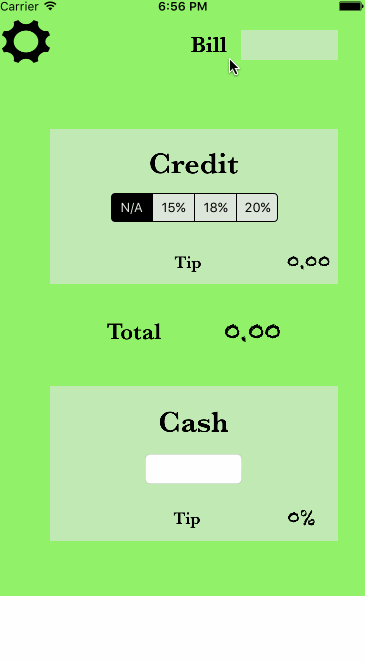

# TipCalculator

This is a Tip Calculator application for iOS submitted as the [pre-assignment](https://gist.github.com/timothy1ee/7747214) requirement for CodePath.
When I started, I wanted to build the tip calculator that I often wanted. When I get the bill, I think “Ok, I have $x in cash — is that a decent enough tip?”. 

This app gives you two options after entering the bill amount: 
1. Select a standard tip percentage and it will tell you the dollar tip amount. I labeled this section “credit”, because it’s the functionality I’d use when I’m paying with a credit card
2. Enter in the amount of cash you have on hand, and it will tell you the percentage tip amount that works out to (it also gives you some colored feedback on whether that is a good tip or not!). I labeled this section “cash”. 

Time spent: 8 hours

Completed:

* [x] Required: User can enter a bill amount, choose a tip percentage, and see the tip and total values.
* [x] Required: Settings page to change the default tip percentage.
* [x] Optional: UI animations
* [ ] Optional: Remembering the bill amount across app restarts (if <10mins)
* [ ] Optional: Using locale-specific currency and currency thousands separators.
* [ ] Optional: Making sure the keyboard is always visible and the bill amount is always the first responder. This way the user doesn't have to tap anywhere to use this app. Just launch the app and start typing.

